# Architecture Diagrams (Mermaid)

## 1. High-Level Request Flow


---

## 2. Three-Phase Pattern (ACCESS Procedure Example)


---

## 3. Component Architecture


---

## 4. Sequence Diagram: ACCESS Procedure


---

## 5. Buffer Encoding/Decoding Flow


---

## 6. Error Handling Flow


---

## 7. Data Flow: Handle to Path

```mermaid
flowchart LR
    subgraph "Client Side"
        CHandle[File Handle<br/>Opaque Identifier]
    end

    subgraph "Server Side - Procedure"
        PHandle[Buffer Handle<br/>From Request]
    end

    subgraph "Server Side - Handler"
        FHMgr[FileHandleManager]
        FHMappings[Handle → Path<br/>Mappings]
    end

    subgraph "Filesystem"
        Path[File Path<br/>/path/to/file]
        FS[fs.promises<br/>Operations]
    end

    CHandle -->|XDR encoded| PHandle
    PHandle --> FHMgr
    FHMappings --> FHMgr
    FHMgr --> Path
    Path --> FS

    style PHandle fill:#87CEEB
    style FHMgr fill:#90EE90
    style FS fill:#DDA0DD
```



---

## 8. Type System Flow

```mermaid
classDiagram
    class AccessHandler {
        <<type>>
        (handle: Buffer, access: number) => Promise~AccessResult~
    }

    class AccessResult {
        <<discriminated union>>
        OK: { status: 0, access: number, statsAfter: Stats }
        Error: { status: number, access?: never }
    }

    class AccessFunction {
        <<procedure>>
        access(xid, socket, data, handler)
    }

    class CreateAsyncNfsHandler {
        <<factory>>
        createAsyncNfsHandler(options)
    }

    class HandlerImplementation {
        async access(handle, requestedAccess) {
            const path = getPathFromHandle(handle)
            await fs.access(path, requestedAccess)
            return { status: OK, access: ... }
        }
    }

    AccessFunction --> AccessHandler : uses
    AccessHandler --> AccessResult : returns
    CreateAsyncNfsHandler --> HandlerImplementation : creates
    HandlerImplementation ..|> AccessHandler : implements
```

---

## 9. Complete ACCESS Procedure Flow (Detailed)


